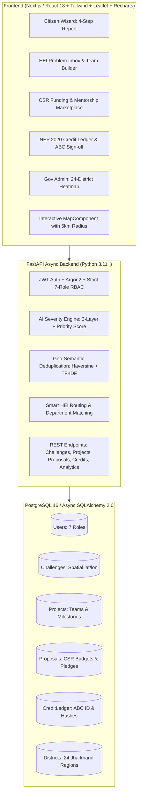

# Societal Innovation Collaboration Portal (SIH-26043)
> **Government of Jharkhand** • High-Impact Platform connecting Citizens, HEIs, CSR/Industry, and Local Bodies  
> **Framework Alignment**: NEP 2020 Experiential Learning & Academic Bank of Credits (ABC)  
> **Scope**: State-wide coverage across all 24 Districts of Jharkhand  

---

## 🏛️ System Architecture Overview



---

## 🛠️ Tech Stack Constraints

- **Frontend**: Next.js 14+ / React 18 (App Router structure), TypeScript, Tailwind CSS, Leaflet.js (GIS Maps with 5km radius & heatmaps), Recharts, Lucide Icons, Framer Motion.
- **Backend**: Python 3.11+, FastAPI (Async), Pydantic v2, SQLAlchemy 2.0 (Asyncpg/Aiosqlite).
- **Database**: PostgreSQL 16 (Spatial indexing for GPS coordinates) / SQLite fallback for instant local run.
- **Security**: JWT Authentication, Argon2 / Bcrypt password hashing, strict RBAC across 7 roles (`CITIZEN`, `LOCAL_BODY`, `HEI_ADMIN`, `FACULTY_LEAD`, `STUDENT`, `INDUSTRY_CSR`, `GOV_ADMIN`).
- **Design System**: Ultra-minimalist "Linear.app" aesthetic (Deep Navy `#0F172A`, Emerald `#10B981`, Slate `#F8FAFC`, Bento-box grids, glassmorphism panels, skeleton loaders).

---

## 🧠 Core Logic & Mathematical Formulas

### 1. AI Severity Engine (3-Layer Assessment)
- **Layer 1: Keyword-Based Critical Hazard Screening**
  - Screens for high-hazard terms: `toxic`, `arsenic`, `chemical spill`, `bridge collapse`, `outbreak`, `cholera`, `mine fire`, `gas leak`, `electrocution`, `flooding`, `dam breach`, `landslide`, `cyanide`, `sewage contamination`.
  - Calculates $\text{Hazard} \in [20, 100]$.
- **Layer 2: Zero-Shot Semantic Urgency Classification**
  - Categorizes urgency: `Critical` (95), `High` (75), `Medium` (55), `Low` (30) based on emergency tokens (`immediate`, `danger`, `collapsed`, `fatal`).
- **Layer 3: Dynamic Severity Escalation Formula**
  $$\text{Priority\_Score} = (0.40 \times \text{Hazard}) + (0.35 \times \text{Urgency}) + (0.15 \times \text{Pop\_Scale}) + (0.10 \times \text{Duplicate\_Spike})$$
  - $\text{Pop\_Scale}$: Normalized score based on affected population ($>5000 \to 100, 1000\text{-}5000 \to 80, 300\text{-}1000 \to 60, 50\text{-}300 \to 40, <50 \to 20$).
  - $\text{Duplicate\_Spike}$: $\min(100, \text{duplicate\_count} \times 25)$.
  - **Threshold Alert**: $\text{Priority\_Score} > 85 \implies \text{STATUS: CRITICAL}$ / `is_emergency = True` (triggers immediate district alert).

### 2. Geo-Semantic Deduplication
- **Haversine Distance Formula**:
  $$d = 2R \arcsin\left(\sqrt{\sin^2\left(\frac{\Delta \phi}{2}\right) + \cos(\phi_1)\cos(\phi_2)\sin^2\left(\frac{\Delta \lambda}{2}\right)}\right)$$
  with $R = 6371.0\text{ km}$, identifying spatial duplicate reports within a $\le 5.0\text{ km}$ radius.
- **Text Similarity ($\ge 80\%$)**:
  TF-IDF vectorizer + Cosine token overlap similarity between report titles and descriptions.

### 3. Smart HEI Routing
Matches challenge categories to specialized Jharkhand HEIs:
- **Agro-Tech & Irrigation** $\to$ *Birsa Agricultural University (BAU) Kanke, Ranchi*
- **Mining & Environmental Safety** $\to$ *IIT (ISM) Dhanbad*
- **Metallurgy & Waste Recycling** $\to$ *NIT Jamshedpur*
- **Water Quality & Remote Sensing** $\to$ *BIT Mesra, Ranchi*
- **Public Health & Epidemiology** $\to$ *RIMS Ranchi*
- **IT & E-Governance** $\to$ *IIIT Ranchi*

---

## 🚀 Quick Start Guide

### 1. Run Backend Locally
```bash
cd backend
# Create and activate virtualenv
python -m venv venv
# Windows:
.\venv\Scripts\activate
# Linux/macOS:
source venv/bin/activate

# Install requirements
pip install -r requirements.txt

# Seed database with realistic 24 Jharkhand districts and demo data
python seed.py

# Run automated test suite
python test_backend.py

# Start FastAPI Async Server
uvicorn app.main:app --reload --host 0.0.0.0 --port 8000
```
- Interactive Swagger API Documentation: `http://localhost:8000/docs`
- ReDoc API Reference: `http://localhost:8000/redoc`

### 2. Run Frontend
```bash
# In the root directory:
npm install
npm run dev
```
Open `http://localhost:5173` in your browser.

### 3. Docker Compose (Full Stack)
```bash
docker compose up --build
```
Spawns:
- PostgreSQL 16 on port `5432`
- FastAPI Backend on port `8000`
- Frontend Web App on port `80` & `5173`

---

## 👥 Demo User Credentials (7 RBAC Roles)

| Role | Email | Password | Scope & Permissions |
|---|---|---|---|
| **CITIZEN** | `citizen@jharkhand.gov.in` | `Password123!` | Report challenges, map pin picker, upvote |
| **LOCAL_BODY** | `localbody@jharkhand.gov.in` | `Password123!` | Ground-truth physical verification sign-off |
| **HEI_ADMIN** | `heiadmin@jharkhand.gov.in` | `Password123!` | Manage departments, accept challenges, faculty roster |
| **FACULTY_LEAD** | `faculty@jharkhand.gov.in` | `Password123!` | Build student teams, submit CSR proposals, verify credits |
| **STUDENT** | `student@jharkhand.gov.in` | `Password123!` | Log NEP 2020 hours, download ABC certificates |
| **INDUSTRY_CSR** | `csr@jharkhand.gov.in` | `Password123!` | Explore proposal marketplace, pledge funds & mentorship |
| **GOV_ADMIN** | `govadmin@jharkhand.gov.in` | `Password123!` | 24-District heatmap, emergency triage, audit records |

---

## 📡 API Endpoint Reference

| Method | Endpoint | Description | Strict RBAC |
|---|---|---|---|
| `POST` | `/api/v1/auth/login` | Authenticate & get JWT Bearer Token | Public |
| `POST` | `/api/v1/auth/register` | Register new user | Public |
| `POST` | `/api/v1/auth/switch-role-demo` | Instant role switch token generator | Public |
| `POST` | `/api/v1/challenges/ai/assess` | Instant 3-layer AI score formula preview | Public |
| `POST` | `/api/v1/challenges` | Citizen submit challenge (AI eval + 5km dedup) | Any Authenticated |
| `GET` | `/api/v1/challenges` | List & filter challenges (district/category/status) | Public |
| `PATCH` | `/api/v1/challenges/{id}/verify` | Local body verification sign-off | `LOCAL_BODY`, `GOV_ADMIN` |
| `POST` | `/api/v1/projects` | HEI accept challenge & create project | `HEI_ADMIN`, `FACULTY_LEAD` |
| `PATCH` | `/api/v1/projects/{id}/team` | Build student research team | `FACULTY_LEAD`, `HEI_ADMIN` |
| `POST` | `/api/v1/proposals` | Faculty submit proposal to CSR marketplace | `FACULTY_LEAD`, `HEI_ADMIN` |
| `POST` | `/api/v1/proposals/{id}/pledge` | CSR Partner pledge funding grant | `INDUSTRY_CSR`, `GOV_ADMIN` |
| `POST` | `/api/v1/credits/log` | Student log experiential learning hours | `STUDENT` |
| `PATCH` | `/api/v1/credits/{id}/verify` | Faculty sign-off & generate SHA-256 hash | `FACULTY_LEAD`, `HEI_ADMIN` |
| `GET` | `/api/v1/credits/certificate/{id}` | Official NEP 2020 Academic Certificate | Public / Authenticated |
| `GET` | `/api/v1/analytics/jharkhand-heatmap` | 24-District GIS emergency heatmap | Public / `GOV_ADMIN` |
| `GET` | `/api/v1/analytics/overview` | State-wide summary metrics & hotspots | Public / `GOV_ADMIN` |
